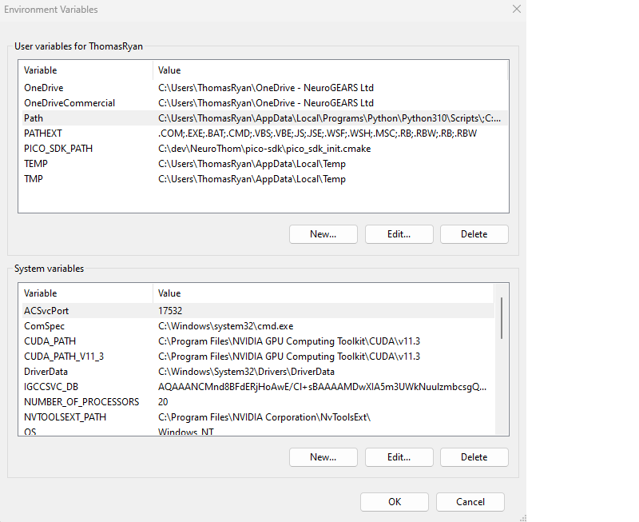
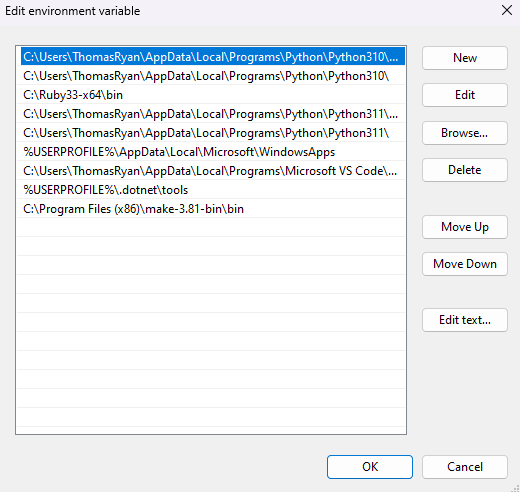
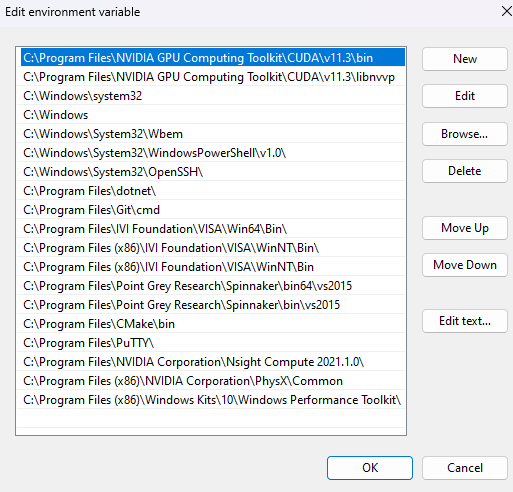

# Quantifying Animal Behaviour
## Download example data, clips and external packages:

[Download: Shared OneDrive Folder](https://neurogears-my.sharepoint.com/:f:/g/personal/t_ryan_neurogears_org/EokFwZYwH_xNvsJVq05I4wgBOxHhyaGkTTZiAKRU6gzrSA?e=Wq4vSY)

Inside you will find a `Data` folder and an `ExternalPackages` folder containing the CuDNN archive. Copy the entire `data` folder from the OneDrive to the root of the repository. (".\quantifying-animal-behavior\data"). You can ignore the "External packages" until later... maybe forever

## Install instructions 
## Bonsai 
- Open the `.bonsai` folder 
Here you will see the `setup.ps1`, `bonsai.config`, and `nuget.config`
- run `setup.cmd`

- This will download and create a local Bonsai installation that you can use to edit and run the Workflows in this project
> **NOTE:**  Yes, we should usually do this using `dotnet new bonsaienv`, but we have done it this way to avoid problems with .Net SDK versions for now. 

## Install external SLEAP dependencies (Optional)
> **NOTE:**  This step is optional for hardware acceleration IF you have a compatible NVidia card. If not, or for slow but less painful install, skip this and download the [CPU version of tensorflow](#install-tensorflow-21). 

([Full instructions](https://bonsai-rx.org/sleap/index.html), but we shouldn't need this!)

In order to use the graphics card for hardware accelerated inference in Bonsai, you will need to install the [Cuda Toolkit 11.3](https://developer.nvidia.com/cuda-11.3.0-download-archive) (for SLEAP multi-animal tracking)
   * Select Custom install and check `CUDA > Development` and `CUDA > Runtime` ONLY (uncheck everything else)
 
Now download [cuDNN 8.2.1](https://developer.nvidia.com/cudnn)

You will need to login to the NVidia website to download cuDNN. But you can also download it from the "External Packages" folder [shared OneDrive folder](https://neurogears-my.sharepoint.com/:f:/g/personal/t_ryan_neurogears_org/EokFwZYwH_xNvsJVq05I4wgBOxHhyaGkTTZiAKRU6gzrSA?e=Wq4vSY) if you have issues

Once installed, could be worth checking your User and System Variables. You should see your python installation on the `Path` of User Variables. It should look something like this:



You should see the CUDA_PATH is correctly pointing to CUDA 11.3

If you double click on the path in user variables, you will see a list of paths. You should find your Python 3.10 installation here



And double click the Path under System variables:

### Install tensorflow 2.1
<u>Windows Binaries:</u>

[Windows download, CPU:](https://storage.googleapis.com/tensorflow/versions/2.18.0/libtensorflow-cpu-windows-x86_64.zip)

[Windows download, GPU:](https://storage.googleapis.com/tensorflow/libtensorflow/libtensorflow-gpu-windows-x86_64-2.10.0.zip)

### Set up python environment for Bonsai.ML
#### 1. <u>(Recommended)</u> Visual Studio Code
[Direct Download: python 3.10 (Windows 64-bit installer)](https://www.python.org/ftp/python/3.10.0/python-3.10.0-amd64.exe) 
[Python release page](https://www.python.org/downloads/release/python-3100/)

Hit Ctrl-P to bring up the command pallette. Choose `Python: Create Environment...`, then `Venv`.
Choose your Python 3.10 installation as the interpreter path, and check the `requirements.txt`.

Done. If you now open a new Powershell terminal, the environment will activate automatically.

#### 2. (Optional) From a command line terminal:

Install virtual env if needed
```bash
pip install virtualenv
```

Create the virtual environment and activate it
```bash
python -m venv .venv
.venv\Scripts\activate
```

```bash 
pip install -r requirements.txt
```
### Run Bonsai from the command line terminal:

```bash
.\.bonsai\Bonsai.exe
```

### Open the workflows!
---
### Tracking Workflows
### <u>1-RoiActivity.bonsai</u>

1. Camera (or `FileCapture`) initialises and grabs our camera stream. We'll `Grayscale` this and pass it to a `PublishSubject` called `Image`

One of the most important aspects of behaviour we are all familiar with is locomotion, i.e. **where** our animal is. The arena is 'controlled' in the sense that we know and control a lot of the conditions of our experiment. We know a lot about the camera, the mouse and the environment. For example, the arena is monochrome white under IR light, providing contrast with our mouse. 
2. Many tools are available in `Bonsai.Vision` to process this image and find our mouse.

   - `CropPolygon` to define our arena and remove extra stuff we don't need (and will mess up downstream processing)
   - `Threshold` to filter out everything except our mouse (more or less)
   - `FindContours` to isolate the 'contour' or 'blob'
   - `BinaryRegionAnalysis` and `TakeLargestRegion` to compute the centroid and other properties of the blob.
   - We can take the `Centroid` and drop it on the image from `CropPolygon` to see it is working accurately

   - Other options from `Bonsai.Vision` include:
      - `MorphologicalOperator` methods, Dilate, Erode, Close with filters of defined shape and size.
      - `BackgroundSubtraction` with options for the number of frames, adaptation rate, and thresholding options in the property grid.
   - Also arithmetic operators to apply to image data
      - Average in time and/or space
Major +++ to Bonsai is you can manipulate the parameters of these operators 'on the fly', making it very easy to prototype and find the perfect parameters.

3. `RoiActivity` node allows you to define any number of polygons, which you can shape with a UI, to define ROIs on your setup and report pixel activity in that region.
   - Some shortcuts:
      - left-click and drag to draw a box
      - shift-left-click and drag to draw a circular polygon
      - left-click to select existing polygon: the blue markers show the polygon points that define the ROI polygon
      
         With the polygon selected, clicking inside the polygon:
         - right-click and drag to grab the nearest point and move it
         - double-left-click to create a new point
         - double-right-click to remove a point
4. This will give us a `RegionActivityCollection` which we can index and send to a `Buffer` for a super-simple visualizer.

### <u>2-flies13_multiAnimal.bonsai</u>

1. Here again we take an image and do some computer vision processing in the `BlobDetection` `GroupWorkflow` "BlobDetection", but this time we have two flies in our arena that are interacting.
2. Major, well known issue with identifying individuals automatically. IDs are assigned frame by frame essentially randomly, so ID switches are common
3. `SortBinaryRegions` sorts the regions by their size. Disabled here by default, and works quite well in this case because the animals are actually different sizes!
4. Can also sort these using some simple kinematics and knowledge about our system. For example we know that flies do not teleport across the arena, and we are recording fast enough (100Hz) that we know the centroid closest to the centroid in the previous frame is most likely to be the same fly. E.g. `BinaryRegionsTracking` from `BonFly` implements this in the `GroupWorkflow` "BonFlyBlobSorting".
5. A different approach that requires far less knowledge about the system (though significantly ore resources and labour in labelling frames etc) is a 'AI' pose estimation model. Bonsai has two very widely used packages to handle this function, [`Bonsai.sleap`](https://bonsai-rx.org/sleap/index.html) and [`Bonsai.deeplabcut`](https://github.com/bonsai-rx/deeplabcut). These support running inference on pretrained models for markerless pose estimation and identity tracking. 

### <u>3-head-tail.bonsai</u>

1. We can also use these 'first-order' points from computer vision or sleap for example, to infer kinematics and other aspects of the animal subject based again on **knowledge of our system**. 
2. We can find the 'extremes' of the `BinaryRegions`.
3. We compute the velocity of each point over a buffer of ten frames.
4. If the velocity is over a certain threshold, we can infer what the 'front' of the mouse is, and therefore the head. If it's below that threshold, then we use the same rule as before, that the points cannot teleport.

### <u>4-ML-eg</u>
#### Bonsai.ML extends the capabilities within Bonsai to infer these kinematics and extend to behavioural state
NICK e.g.

### Goncalo ethogram

#### P.S. 
#### Visual Studio Community (optional)

1. Download and run [Visual Studio Community](https://visualstudio.microsoft.com/vs/community/).
2. Check .NET Desktop Development workload
3. (optional) uncheck IntelliCode support.

Launch Visual Studio, and set some options up:

Navigate to `TOOLS->Options->Debugging->General` and disable "Require source files to exactly match the original version" .

Go to `TOOLS->Options->Debugging->Symbols` and enable the Microsoft Symbols Server.
Finally, under `TOOLS->Options->Debugging`, check "Enable Just My Code' and "use Manage/Unmanage mode".